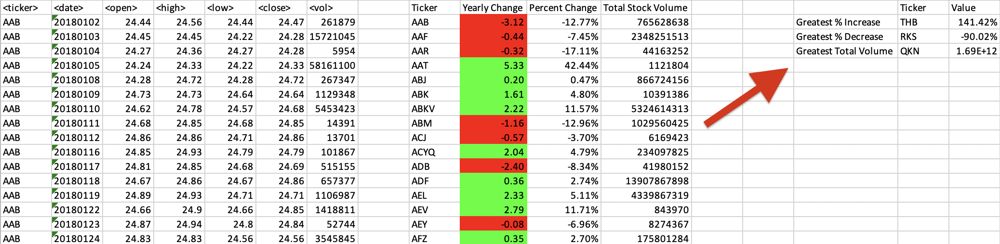

Homework Description + Results

# VBA Homework: The VBA of Wall Street

## Background

You are well on your way to becoming a programmer and Excel master! In this homework assignment, you will use VBA scripting to analyze generated stock market data. Depending on your comfort level with VBA, you may choose to challenge yourself with a few of the challenge tasks.

### Before You Begin

1. Create a new repository for this project called `VBA-challenge`. **Do not add this homework to an existing repository**.

2. Inside the new repository that you just created, add any VBA files that you use for this assignment. These will be the main scripts to run for each analysis.

### Files

* [Test Data](Resources/alphabetical_testing.xlsx) - Use this while developing your scripts.

* [Stock Data](Resources/Multiple_year_stock_data.xlsx) - Run your scripts on this data to generate the final homework report.

### Stock Market Analyst

## Instructions

Create a script that loops through all the stocks for one year and outputs the following information:

  * The ticker symbol.

  * Yearly change from opening price at the beginning of a given year to the closing price at the end of that year.

  * The percent change from opening price at the beginning of a given year to the closing price at the end of that year.

  * The total stock volume of the stock.

**Note:** Make sure to use conditional formatting that will highlight positive change in green and negative change in red.

The result should match the following image:

## Bonus

Add functionality to your script to return the stock with the "Greatest % increase", "Greatest % decrease", and "Greatest total volume". The solution should match the following image:

Make the appropriate adjustments to your VBA script to allow it to run on every worksheet (that is, every year) just by running the VBA script once.

## Analysis:

This project used (VBA) programming language to analyze generate more than 750K stock market data.
The results of the analyses provide insights into about 3K unique stock's   

➊ Ticker Symbol,   

➋ Yearly Change,  

➌ Percent Change,  

➍ Total Stock Volume, 

## Code

For Each ws In Worksheets
    
    Dim Ticker_name As String
    Dim GrInTicker As String
    Dim GrDeTicker As String
    Dim TotVoTicker As String
    Dim Ticker_Summary As Integer
    Dim TotalStockVolume As Double
    Dim Openvalue As Double
    Dim Closevalue As Double
    Dim YearlyChange As Double
    Dim PrecentChange As Double
    Dim GreatestIncrease As Double
    Dim GreatestDecrease As Double
    Dim GreatestTotalVolume As Double
    Dim PercentChangeRange As Range
    Dim YearlyChangeRange As Range
    Set YearlyChangeRange = ws.Range("J:J")
    

    Ticker_Summary = 2
    lastrow = ws.Cells(Rows.Count, 1).End(xlUp).Row
    TotalStockVolume = ws.Cells(2, 7).Value
    Openvalue = ws.Cells(2, 3).Value
    GreatestIncrease = 0
    GreatestDecrease = 0
    GreatestTotalVolume = 0

    ' CORRECT CELLS FORMAT
    ws.Range("K:K").NumberFormat = "0.00%"
    ws.Range("J:J").NumberFormat = "0.00"
    ws.Cells(1, 9).Value = "Ticker"
    ws.Cells(1, 10).Value = "Yearly Change"
    ws.Cells(1, 11).Value = "Percent Change"
    ws.Cells(1, 12).Value = "Total Stock Volume"
    ws.Cells(1, 16).Value = "Ticker"
    ws.Cells(1, 17).Value = "Value"
    ws.Cells(2, 15).Value = "Greatest % Increase"
    ws.Cells(3, 15).Value = "Greatest % Decrease"
    ws.Cells(4, 15).Value = "Greatest Total Volume"

    For i = 2 To lastrow
        If ws.Cells(i + 1, 1).Value <> ws.Cells(i, 1).Value Then
            Ticker_name = ws.Cells(i, 1).Value
            YearlyChange = Closevalue - Openvalue
            PrecentChange = YearlyChange / Openvalue
            ws.Range("I" & Ticker_Summary).Value = Ticker_name
            ws.Range("J" & Ticker_Summary).Value = YearlyChange
            ws.Range("K" & Ticker_Summary).Value = PrecentChange

                'Greatest % Increase & Greatest % Decrease
                If PrecentChange > GreatestIncrease Then
                    GreatestIncrease = PrecentChange
                    GrInTicker = Ticker_name
                ElseIf PrecentChange < GreatestDecrease Then
                    GreatestDecrease = PrecentChange
                    GrDeTicker = Ticker_name
                End If
                
            ws.Range("L" & Ticker_Summary).Value = TotalStockVolume

                'Greatest Total Volume
                If TotalStockVolume > GreatestTotalVolume Then
                    GreatestTotalVolume = TotalStockVolume
                    TotVoTicker = Ticker_name
                End If
            
            TotalStockVolume = ws.Cells(i + 1, 7).Value
            Ticker_Summary = Ticker_Summary + 1
            Openvalue = ws.Cells(i + 1, 3).Value

        ElseIf ws.Cells(i + 1, 1).Value = ws.Cells(i, 1).Value Then
            TotalStockVolume = TotalStockVolume + ws.Cells(i + 1, 7).Value
            Closevalue = ws.Cells(i + 1, 6).Value
        End If

    Next i
    'Yearly Change Column Color (Column J)
    For Each Cell In YearlyChangeRange
        If Cell.Value > 0 Then
            Cell.Interior.ColorIndex = 4
        ElseIf Cell.Value < 0 Then
            Cell.Interior.ColorIndex = 3
        Else
            Cell.Interior.ColorIndex = xlNone
        End If
    Next
    ws.Cells(1, 10).Interior.ColorIndex = xlNone

    ws.Cells(2, 16).Value = GrInTicker
    ws.Cells(3, 16).Value = GrDeTicker
    ws.Cells(4, 16).Value = TotVoTicker
    ws.Cells(2, 17).Value = GreatestIncrease
    ws.Cells(2, 17).NumberFormat = "0.00%"
    ws.Cells(3, 17).Value = GreatestDecrease
    ws.Cells(3, 17).NumberFormat = "0.00%"
    ws.Cells(4, 17).Value = GreatestTotalVolume
    ws.Cells(4, 17).NumberFormat = "0.00E+00"
    'Columns width Autofit
    ws.Columns("A:R").AutoFit
Next. 
  
  
## RESULTS:  

2018: THB had the greatest yearly percent change increase of all stocks at 141.42%.  

2019: RYU had the greatest yearly percent change increase of all stocks at 190.03%.  

2020: YDI had the greatest yearly percent change increase of all stocks at 188.76%.  

